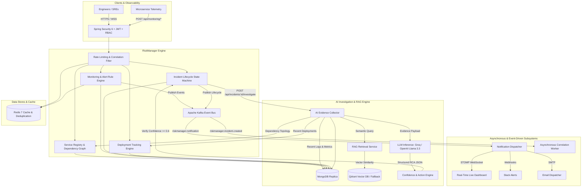

# RISKMANAGER
### AI-Powered Incident Management, Monitoring, Alerting and Root-Cause Analysis Platform

> **RiskManager** is an enterprise-grade Site Reliability Engineering (SRE) and DevOps operational platform designed to monitor microservice topologies, detect anomalous behaviors, correlate alert storms into deduplicated incidents, manage strict incident lifecycles, orchestrate automated evidence collection, execute RAG-augmented AI Root-Cause Analysis (RCA) with human-in-the-loop safeguards, and compute operational reliability KPIs such as MTTR and MTTA.

---

## 1. System Architecture



---

## 2. Core Technology Stack

| Layer | Technology | Architectural Rationale |
| :--- | :--- | :--- |
| **Language & Runtime** | Java 21 (LTS) | Virtual threads, modern pattern matching, records, sealed types, G1GC high throughput. |
| **Backend Framework** | Spring Boot 3.5.x | Native cloud architecture, Spring Security 6, Spring Data, Actuator metrics. |
| **Operational Database**| MongoDB 7.0 | Semi-structured incident telemetry, variable log contexts, JSON documents, compound indexes. |
| **Event Streaming** | Apache Kafka 3.8 (KRaft) | Non-blocking asynchronous event decoupling, notification fan-out, dead-letter topics (DLT). |
| **Cache & Rate Limiting**| Redis 7.2 | High-speed sliding-window rate limiting, alert storm cooldowns, deduplication locks. |
| **Real-Time Delivery** | WebSockets (STOMP) | Low-latency full-duplex dashboard synchronization without browser polling. |
| **Vector Database** | Qdrant | Fast HNSW vector indexing for SRE runbooks, historical postmortems, and similarity retrieval. |
| **AI / LLM Engine** | Groq / OpenAI Compatible API | Ultra-low latency inference (Llama-3.3-70B) for instant root-cause diagnostics. |
| **Documentation** | SpringDoc OpenAPI 3 / Swagger | Interactive live API contracts, authentication headers, schema exploration. |
| **Containerization** | Docker & Docker Compose | Multi-stage production containerization with hardened Alpine JRE. |

---

## 3. Key Architectural Principles & Interview Q&A

### 1. Why MongoDB?
Incidents, logs, and telemetry are semi-structured by nature. Log contexts vary by service, alerts carry arbitrary key-value metadata, and timeline events contain heterogeneous payloads. MongoDB provides schema flexibility with native compound indexing on high-cardinality fields (`status`, `severity`, `affectedServiceId`, `correlationKey`, `timestamp`).

### 2. Why Apache Kafka?
In an enterprise environment with hundreds of microservices, incident creation and alert surges must not block HTTP ingestion threads. Kafka decouples operational ingestion from heavy downstream tasks:
- Multi-channel notification fan-out (WebSocket, Slack, Email).
- Asynchronous correlation and enrichment.
- Exponential backoff and Dead Letter Topics (`.DLT`) ensure zero dropped alerts during third-party notification outages.

### 3. Why Redis?
Redis provides sub-millisecond atomic primitives (`INCR`, `EXPIRE`) used for:
- Sliding-window IP/user rate limiting on authentication and mutation endpoints.
- Alert rule cooldown tracking (suppressing duplicate alerts for 5 minutes).
- Temporary caching for dashboard aggregations to protect MongoDB from repetitive high-frequency dashboard queries.

### 4. Why WebSockets (STOMP)?
In an active outage, engineers need real-time incident updates, alert triggers, and service state changes instantly. Polling every 5 seconds wastes server CPU and database I/O. STOMP over WebSockets pushes notifications directly to subscribed dashboard clients the millisecond an event occurs.

### 5. Why RAG and Vector Database (Qdrant)?
LLMs lack proprietary knowledge of internal microservice runbooks, architectural quirks, and past incident postmortems. RiskManager uses RAG:
1. Ingests runbooks, guides, and postmortems.
2. Embeds document chunks into Qdrant.
3. During an incident, performs similarity search matching the error signature.
4. Supplies relevant runbook snippets to the LLM prompt so recommendations cite verified engineering runbooks instead of hallucinating.

### 6. Why JWT & Stateless RBAC?
Stateless JWT access tokens eliminate server-side session stores, enabling horizontal scaling behind an AWS Application Load Balancer. Role-Based Access Control enforces strict operational boundaries:
- `ADMIN`: User management, service registry configuration, alert rule creation.
- `ENGINEER`: Incident acknowledgment, status transitions, assigning engineers, triggering AI RCA.
- `VIEWER`: Read-only visibility into dashboards, incidents, and service health.

### 7. How Does Incident Deduplication & Correlation Work?
When an alert or error arrives, the system computes a `correlationKey` (e.g. `serviceId + ":" + errorSignature`). The engine searches for an active incident with that key in non-resolved status (`OPEN`, `ACKNOWLEDGED`, `INVESTIGATING`).
- **If found**: It increments `eventCount++`, appends fresh logs to the existing incident, updates `updatedAt`, and logs a `CORRELATED_EVENT_ADDED` timeline event.
- **If not found**: It creates a new incident.
This prevents 1,000 duplicate payment errors from creating 1,000 separate incidents.

### 8. How Does the AI Root-Cause Analysis (RCA) Work?
When an incident is set to `INVESTIGATING`, the engineer triggers `POST /api/incidents/{id}/investigate`:
1. `AiEvidenceCollector` aggregates:
   - Incident description and error logs.
   - Microservice health status and upstream/downstream dependency graph.
   - Recent deployments (within lookback window).
   - Historical resolved incidents on the same service.
   - Relevant runbooks retrieved from RAG.
2. The prompt strictly instructs the LLM:
   - *"Only use the supplied evidence. Do NOT hallucinate logs or facts. Output structured JSON with fields: probableRootCause, confidenceScore, supportingEvidence, recommendedActions, affectedComponents, uncertainties, deploymentCorrelation."*
3. If confidence is `< 0.6`, the system flags: *"Insufficient evidence for a reliable root-cause determination."*
4. AI **never** executes destructive commands directly; it empowers the on-call engineer with decision support.

### 9. How Does the System Handle LLM Provider Outages?
Resilience is built-in. If the external LLM API times out, returns HTTP 5xx, or if no API key is provided, `LlmClient` gracefully falls back to a deterministic heuristic rules engine that inspects recent deployments, service dependencies, and error logs. The core incident lifecycle **never breaks** due to external AI downtime.

### 10. How Are Alert Storms Prevented?
Each `AlertRule` defines a `cooldownMinutes` parameter (e.g. 5 minutes). When an alert triggers, `lastTriggeredAt` is recorded in MongoDB and Redis. If subsequent metric spikes arrive before the cooldown window expires, the engine logs the event as suppressed rather than spamming on-call channels.

### 11. How Does the System Calculate MTTR and MTTA?
- **MTTA (Mean Time to Acknowledge)**: \(\frac{1}{N} \sum (\text{acknowledgedAt} - \text{createdAt})\)
- **MTTR (Mean Time to Resolve)**: \(\frac{1}{N} \sum (\text{resolvedAt} - \text{createdAt})\)
Computed dynamically over 24h, 7d, and 30d sliding windows across all resolved incidents.

### 12. How Does Deployment Correlation Work?
`DeploymentService` tracks microservice releases (`version`, `commitHash`, `deployedAt`, `changelog`). When an incident occurs, the correlation engine checks if a deployment took place on the affected service or its direct dependencies within the preceding 60 minutes. If correlated, the AI investigation flags the deployment as a primary suspect and recommends rollback.

---

## 4. Incident Lifecycle State Machine

Transitions are validated deterministically by `IncidentStateMachine`:

```
 [ OPEN ] ───────► [ ACKNOWLEDGED ]
    │                      │
    ▼                      ▼
 [ INVESTIGATING ] ◄───────┘
    │          ▲
    │          │ (re-opened if issue recurs)
    ▼          │
 [ MITIGATED ] │
    │          │
    ▼          │
 [ RESOLVED ] ─┘
    │
    ▼
 [ CLOSED ] (Terminal state)
```

- Invalid transitions (e.g. `CLOSED -> INVESTIGATING` or `CLOSED -> OPEN`) return `400 Bad Request`.
- Every transition automatically appends a timestamped audit record to `incident_events`.

---

## 5. Getting Started (Local Development)

### Prerequisites
- **Java 21** (Eclipse Temurin or OpenJDK)
- **Maven 3.9+** (or use included `./mvnw`)
- **Docker & Docker Compose**

### Running with Docker Compose (Recommended)
Launch the entire production stack (RiskManager, MongoDB, Redis, Kafka, Qdrant) with a single command:

```bash
docker compose up --build -d
```

Verify running containers:
```bash
docker compose ps
```

| Service | Container Name | Local Port |
| :--- | :--- | :--- |
| **RiskManager App** | `riskmanager-app` | `http://localhost:8080` |
| **Swagger UI** | - | `http://localhost:8080/swagger-ui.html` |
| **MongoDB** | `riskmanager-mongodb` | `localhost:27017` |
| **Redis** | `riskmanager-redis` | `localhost:6379` |
| **Apache Kafka** | `riskmanager-kafka` | `localhost:9092` |
| **Qdrant Vector DB** | `riskmanager-qdrant` | `http://localhost:6333` |

### Running the Spring Boot Application Locally
If running standalone against local or Dockerized MongoDB/Redis:
```bash
cd incident-platform
./mvnw clean spring-boot:run
```

The application automatically seeds realistic demo data on startup!

---

## 6. Pre-seeded Demo Accounts

| Role | Email | Password | Permissions |
| :--- | :--- | :--- | :--- |
| **ADMIN** | `admin@riskmanager.io` | `admin123` | Full access to users, services, rules, documents, and audit logs. |
| **ENGINEER** | `engineer@riskmanager.io` | `engineer123` | Manage incidents, investigate, trigger AI RCA, resolve. |
| **VIEWER** | `viewer@riskmanager.io` | `viewer123` | Read-only access to dashboard, incidents, and service health. |

---

## 7. Step-by-Step Demo Scenario

Follow this live flow to demonstrate the full platform capabilities in Swagger UI (`http://localhost:8080/swagger-ui.html`):

### Step 1: Authenticate as Engineer
Send `POST /api/auth/login`:
```json
{
  "email": "engineer@riskmanager.io",
  "password": "engineer123"
}
```
Copy the returned `token` and click **Authorize** in Swagger UI.

### Step 2: Inspect Microservice Topology
Call `GET /api/services`:
- Notice 5 pre-seeded microservices: `api-gateway`, `auth-service`, `order-service`, `payment-service`, `notification-service`.
- Call `GET /api/services/{id}/dependencies` on `payment-service` to view upstream and downstream dependencies.

### Step 3: View Operational Dashboard
Call `GET /api/dashboard?window=24h`:
- Inspect MTTR, MTTA, service availability percentage, and incidents by severity.

### Step 4: Ingest a New Service Deployment
Simulate a deployment for `payment-service`:
`POST /api/deployments`
```json
{
  "serviceId": "<PAYMENT_SERVICE_ID>",
  "version": "2.4.2",
  "environment": "production",
  "deployedBy": "ci-release-bot",
  "changelog": "Update payment gateway connection timeout from 5000ms to 500ms"
}
```

### Step 5: Simulate Telemetry Spike & Ingest Errors
Simulate errors resulting from the bad timeout change:
`POST /api/monitoring/logs`
```json
{
  "serviceId": "<PAYMENT_SERVICE_ID>",
  "level": "CRITICAL",
  "message": "ConnectionTimeoutException: Unable to establish handshake with payment gateway in 500ms",
  "logger": "PaymentGatewayClient",
  "traceId": "trace-9842"
}
```

### Step 6: Ingest Telemetry Metric Triggering Alert Rule
`POST /api/monitoring/metrics`
```json
{
  "serviceId": "<PAYMENT_SERVICE_ID>",
  "metricName": "error_rate",
  "value": 24.5,
  "unit": "%"
}
```
- The Alert Engine detects `error_rate > 15.0`.
- It triggers a `HIGH` severity alert.
- Because severity is `HIGH`, it automatically creates/correlates an incident and dispatches WebSocket and Slack alerts!

### Step 7: Verify Event Correlation & Deduplication
Send another identical error log or call `POST /api/incidents`:
- Inspect the incident: Notice `eventCount` incremented, and the timeline record displays `CORRELATED_EVENT_ADDED` rather than flooding the dashboard with duplicate tickets!

### Step 8: Trigger AI Root-Cause Analysis (RCA)
Open the incident and call:
`POST /api/incidents/{id}/investigate`
- Incident status moves to `INVESTIGATING`.
- RiskManager collects logs, deployment history (detecting version 2.4.2), dependency graphs, and RAG runbooks.
- The AI produces:
  - **Probable Root Cause**: *"Recent deployment 2.4.2 reduced gateway handshake timeout to 500ms, inducing cascading connection timeouts."*
  - **Confidence Score**: `0.88`
  - **Supporting Evidence**: Deployment timestamp, correlated logs, and error rate surge.
  - **Recommended Actions**: *"1. Initiate immediate canary rollback to v2.4.1. 2. Restore 5000ms timeout."*

### Step 9: Mitigate and Resolve Incident
1. `PATCH /api/incidents/{id}/status` -> Set status to `MITIGATED` with note: *"Rolled back to v2.4.1"*.
2. `PATCH /api/incidents/{id}/status` -> Set status to `RESOLVED` with note: *"Error rates normalized to 0.1%"*.
3. `GET /api/dashboard`: Verify MTTR and MTTA metrics are updated.
4. `GET /api/incidents/{id}/timeline`: View the complete immutable audit trail.

---

## 8. AWS Production Deployment Topology

```
                   Internet / VPN
                         │
                         ▼
        [ AWS Application Load Balancer ]
                         │
                         ▼
       [ AWS ECS Fargate / EKS Pods ]
            RiskManager Spring Boot
          (Stateless Auto-scaling)
           │           │           │
     ┌─────┴────┐ ┌────┴─────┐ ┌───┴──────────┐
     ▼          ▼ ▼          ▼ ▼              ▼
[ AWS DocDB ]  [ ElastiCache ]  [ Amazon MSK ]   [ Qdrant Cloud / ]
  (MongoDB)       (Redis)          (Kafka)       [ OpenSearch Vec ]
```

### Environment Variables Mapping for AWS:
- `MONGODB_URI`: Set to AWS DocumentDB cluster connection string with TLS.
- `REDIS_HOST`: Set to AWS ElastiCache primary endpoint.
- `KAFKA_BOOTSTRAP_SERVERS`: Set to AWS Amazon Managed Streaming for Kafka (MSK) broker list.
- `JWT_SECRET`: Injected dynamically from AWS Secrets Manager.
- `LLM_API_KEY`: Injected from AWS Secrets Manager.

---

## 9. Test Suite Verification

Run the entire automated JUnit 5 test suite:
```bash
./mvnw clean test
```

All 19 unit tests verify:
- Security & JWT authentication filter.
- User management and duplicate email prevention.
- Deterministic incident lifecycle state machine validation.
- Incident correlation and event deduplication.
- Service registry dependency graph resolution.
- Alert rule evaluation and storm suppression cooldowns.
- AI evidence aggregation and RCA fallback behavior.
- Dashboard MTTR and service availability calculations.
